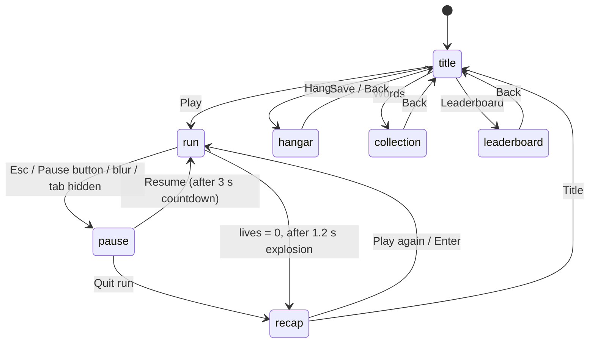

# Architecture

How the game is built: two files, one `state` object, one frame loop. Read the [GDD](GDD.md) first; this document explains *how* to implement it, never *what* the game does.

## Contents

- [Files](#files)
- [File layout of game.js](#file-layout-of-gamejs)
- [The state object](#the-state-object)
- [Frame loop](#frame-loop)
- [Screens](#screens)
- [Run systems](#run-systems)
- [Rendering](#rendering)
- [Input](#input)
- [Audio](#audio)
- [Storage](#storage)
- [Function naming and responsibilities](#function-naming-and-responsibilities)
- [Interpretations of the GDD](#interpretations-of-the-gdd)

## Files

| File | Responsibility |
| --- | --- |
| `index.html` | Page shell. One `<canvas id="game">`, one `<input id="word">`, a **Fire** button (56 × 56 px) and a **Pause** button (44 × 44 px) below the canvas, a few lines of CSS (`image-rendering: pixelated`, dark background, layout). Loads `game.js` with `<script src="game.js" defer>`. No other markup. |
| `game.js` | Everything else. |

There is no build step. Opening `index.html` from disk must work.

## File layout of game.js

Sections appear in this order, each opened by a banner comment such as `// ===== 4. STATE =====`.

| # | Section | Contains |
| --- | --- | --- |
| 1 | Header | `'use strict'`, one-paragraph description, link to the GDD |
| 2 | Constants | Every tuning number, colour, string and storage key. See [CONSTANTS.md](CONSTANTS.md). Includes `CLUB_WORD` and `CLUB_COLORS` at the very top so the club leader can find them. |
| 3 | Sprite grids | Ship shapes, enemies, heart, pip as arrays of strings. Constant data. |
| 4 | State | `createState()` and `createRun()`; the single `state` variable. |
| 5 | Utilities | Pure helpers: `clamp`, `lerp`, `randInt`, `randRange`, `pickWeighted`, `normalizeWord`, `formatDate`. |
| 6 | Storage | `loadJson`, `saveJson`, `loadSave`, `saveShip`, `saveLeaderboard`, `saveCollection`, `saveSettings`. |
| 7 | Words | `buildWordSet`, `validateWord`, `laserForLength`. |
| 8 | Audio | `ensureAudio`, `playTone`, `playNoise`, one `play…` function per sound event. |
| 9 | Sprites | `renderGrid`, `buildShipSprites`, `buildEnemySprites`, `rebuildShipCache`. |
| 10 | Run logic | Starting, updating and ending a run: speed, spawner, enemy movement, word submission, damage, lives. |
| 11 | Achievements | `checkWordAchievements`, `checkTimeAchievements`, `awardAchievement`. |
| 12 | Effects | Sparks, pop-ups, screen shake, starfield update. |
| 13 | Screens | For each screen: `layoutX()`, `updateX(dt)`, `drawX()`, `handleXKey(e)`, `handleXPointer(p)`. |
| 14 | Render helpers | `drawText`, `drawButton`, `drawStarfield`, `drawShip`, `drawEnemy`, `drawLaser`, `drawParticles`, `drawHud`. |
| 15 | Input wiring | DOM listeners; routes events to the current screen's handlers. |
| 16 | Main loop | `frame(t)`, `resizeCanvas()`, `boot()`. |
| 17 | Word list | `const WORD_LIST_RAW = 'able about above …';` |
| — | Last line | `boot();` |

**Why the word list is at the bottom:** it is about 70 KB of text and would bury the constants. It is a `const`, so referencing it before its declaration line runs throws a `ReferenceError`. That is why `boot()` must be the **last line of the file**, after `WORD_LIST_RAW`. This is the one allowed exception to "constants at the top" and it is noted in the header comment.

Target size: about 2,000 lines excluding the word list.

## The state object

All mutable data lives in one object. Functions receive nothing else: they read and write `state`. Anything that can be rebuilt from other data lives under `state.cache`, and nothing under `cache` is ever saved.

```js
let state = createState();

// Shape (values shown are initial values)
state = {
  screen: 'title',            // 'title' | 'hangar' | 'run' | 'pause' | 'recap' | 'leaderboard' | 'collection'
  prevScreen: null,           // screen to return to from 'pause'

  clock: { last: 0, dt: 0, t: 0 },   // t = seconds since boot, not counting paused time

  ship: {                     // current Hangar choice, saved as llb.ship
    name: 'PILOT',
    shape: 'arrow',           // id from SHIP_SHAPES
    main: 'blue',             // id from SHIP_MAIN_COLORS
    second: 'white',          // id from SHIP_SECOND_COLORS
    laser: 'cyan',            // id from LASER_COLORS
  },

  save: {                     // mirrors localStorage; see SAVE_DATA.md
    leaderboard: [],          // up to LEADERBOARD_SIZE entries, sorted by score desc
    collection: new Set(),    // lifetime words
    settings: { sound: true, best: 0, seenHowTo: false },
    ok: true,                 // false once any storage call has failed
  },

  run: null,                  // createRun() while a run or its recap exists

  ui: {
    focus: 0,                 // keyboard-selected button index on menu screens
    hangarRow: 0,             // selected row in the Hangar
    hangarDemoT: 0,           // time into the Light→Heavy→Mega preview loop
    editingName: false,
    collectionLetter: null,   // 'a'..'z' when a letter is open on the Word Collection screen
    lastEscT: -1,             // for the Esc double-tap
    resumeT: 0,               // > 0 while the resume countdown runs
  },

  input: { text: '' },        // mirror of the DOM <input>, already normalised

  view: { cssW: 0, cssH: 0, keyboardOpen: false },

  audio: { ctx: null, master: null, noise: null },

  stars: [],                  // STAR_COUNT stars: { x, y, layer }

  cache: {
    words: null,              // Set built from WORD_LIST_RAW + CLUB_WORD
    shipSprites: null,        // pre-rendered canvases for the current ship choice
    enemySprites: null,       // { scout, fighter, cruiser, scoutFlash, … }
    iconCache: new Map(),     // leaderboard ship icons keyed by 'shape|main|second|laser'
  },
};
```

```js
// createRun() — everything that belongs to one run and its recap
{
  elapsed: 0,                 // seconds of play, paused time excluded
  baseSpeed: SPEED_START,
  lives: LIVES_START,
  score: 0,
  target: 'r',                // current target letter
  used: new Set(),            // words used this run
  chain: [],                  // [{ word, isNew, damage }] in order, for the recap
  streak: 0,                  // valid words since the last hit
  noHitT: 0,                  // seconds since the last hit (Full Shields)
  kills: 0,
  achievements: {},           // id → count
  onceAwarded: new Set(),     // ids of once-per-run achievements already given

  enemy: null,                // { type, x, y, baseY, armor, maxArmor, flashT, bobPhase, damagedBefore }
  spawnT: SPAWN_DELAY_START,  // countdown to the next spawn; only runs while enemy === null

  lasers: [],                 // { tier, x1, y1, x2, y2, t }
  particles: [],              // { x, y, vx, vy, t, life, color }
  popups: [],                 // { text, x, y, t, color }
  shake: { t: 0, px: 0 },
  shipBlinkT: 0,
  inputShakeT: 0,
  message: { text: '', t: 0 },
  flashWord: { word: '', t: 0 },   // repeated word flashing red in the used-words strip

  dyingT: 0,                  // > 0 during the 1.2 s explosion before the recap
  over: false,
  newBest: false,
  rank: -1,                   // leaderboard index after the run, -1 if not placed
}
```

## Frame loop

```js
function frame(now) {
  const dt = Math.min((now - state.clock.last) / 1000, MAX_DT);  // clamp after tab switches
  state.clock.last = now;
  updateScreen(dt);   // dispatch to updateTitle / updateRun / …
  drawScreen();       // dispatch to drawTitle / drawRun / …
  requestAnimationFrame(frame);
}
```

- One `requestAnimationFrame` loop for everything; no `setTimeout`/`setInterval` for game logic. Every timer is a number in `state` counted down by `dt`.
- `MAX_DT` (0.05 s) stops a long frame from teleporting the enemy into the ship.
- On the `pause` screen `updateRun` is not called, so run time, speed ramp and all run timers freeze. The starfield keeps drifting slowly for life.
- Update and draw never mix: `update…` functions never touch the canvas, `draw…` functions never change state.

## Screens



Each screen provides the same five functions, so `updateScreen`, `drawScreen` and the input router are plain lookups in a `SCREENS` table:

```js
const SCREENS = {
  title:       { update: updateTitle,  draw: drawTitle,  key: handleTitleKey,  pointer: handleTitlePointer },
  run:         { update: updateRun,    draw: drawRun,    key: handleRunKey,    pointer: handleRunPointer },
  // …
};
```

`layoutX()` is a pure function that returns the screen's buttons as rectangles in internal pixels (`{ id, label, x, y, w, h }`). Both `drawX()` and `handleXPointer()` call it, so drawing and hit-testing can never disagree, and no button list is stored in state.

| Screen | Notes |
| --- | --- |
| `title` | Shows `settings.best`, `CLUB_WORD`, ship idling. First launch (`seenHowTo === false`) shows the 3-line How to play card; dismissing it sets the flag and saves settings. |
| `hangar` | Four choice rows plus a name row. Preview at `HANGAR_PREVIEW_SCALE` (4×) loops Light → Heavy → Mega and plays each laser sound. Every change calls `rebuildShipCache()`. **Save** writes `llb.ship`. |
| `run` | Gameplay and HUD. The DOM input is visible and focused only on this screen (and on the name row of the Hangar). |
| `pause` | Draws the frozen run with a dim overlay that hides the enemy and its badge. Resume starts a 3 s countdown (`ui.resumeT`); the overlay stays until it reaches 0, then the screen returns to `run`. |
| `recap` | Reads `state.run` after `endRun()`. Word chain as wrapped chips, new words marked. |
| `leaderboard` | Top 10 from `state.save.leaderboard`, ship icons from `cache.iconCache`. |
| `collection` | A–Z grid of counts; selecting a letter lists its words, sorted alphabetically, scrollable with arrows or swipe. |

## Run systems

Called from `updateRun(dt)` in this order each frame (skipped entirely while `dyingT > 0`, except effects and the dying countdown):

1. `updateElapsed(dt)` — `run.elapsed += dt`, `run.noHitT += dt`.
2. `updateSpeed(dt)` — `baseSpeed = min(SPEED_MAX, baseSpeed + SPEED_RAMP * dt)`.
3. `updateSpawner(dt)` — if no enemy, count `spawnT` down; at 0 call `spawnEnemy()`.
4. `updateEnemy(dt)` — move toward the ship, bob, count down `flashT`; if within `HIT_RADIUS`, call `hitShip()`.
5. `checkTimeAchievements()` — Speed Demon, Full Shields.
6. `updateEffects(dt)` — lasers, particles, pop-ups, shake, ship blink, input shake, message.

Event functions, called from input or from the steps above:

| Function | Does |
| --- | --- |
| `startRun()` | `state.run = createRun()`, random start letter from `START_LETTERS`, spawn timer 1.0 s, screen `run`, focus input. |
| `pickEnemyType()` | Scout if the target is rare; otherwise `pickWeighted` over the row of `SPAWN_TABLE` for `run.elapsed`. |
| `spawnEnemy()` | Creates the enemy at `ENEMY_SPAWN_X`, random y in `[ENEMY_SPAWN_Y_MIN, ENEMY_SPAWN_Y_MAX]`; plays the rare-letter warning if the target is rare. |
| `enemySpeed()` | `baseSpeed × type.speed × (isRare(target) ? RARE_SPEED_FACTOR : 1)`. Recomputed every frame. |
| `submitWord()` | Normalises input, calls `validateWord()`. On failure: message, input shake, buzz, keep text. On success: `fireLaser()`. |
| `validateWord(word)` | Pure. Returns `{ ok: true }` or `{ ok: false, reason: 'short' | 'letter' | 'used' | 'unknown' | 'noEnemy' }`, checking in the GDD's order. The `noEnemy` check runs first. |
| `fireLaser(word)` | Adds the word to `used`, `chain` and the collection; scores the word; picks the tier with `laserForLength`; adds the beam, plays its sound; calls `applyDamage`; sets the new target to the word's last letter; runs `checkWordAchievements`. |
| `applyDamage(tier)` | Removes armor. If armor remains: flash 0.1 s, knock back `KNOCKBACK_PX_PER_DAMAGE × damage`. Otherwise `destroyEnemy()`. |
| `destroyEnemy()` | Kill bonus, sparks, gold pop-up, sound, `kills++`, One Shot check, `spawnT = 0.4`. |
| `hitShip()` | Life −1, enemy explodes, blink 1.0 s, `baseSpeed −= 20` (min 60), `streak = 0`, `noHitT = 0`, shake 0.25 s, `spawnT = 1.0`, target unchanged. At 0 lives: `dyingT = 1.2`. |
| `endRun()` | Personal best, leaderboard insert, save collection, set `newBest`/`rank`, screen `recap`, play Game over (and New best). Also called by **Quit run**. |

Scoring uses pure helpers so they can be checked from the console:

```js
speedMultiplier(speed) // 1 + (speed - 60) / 200  → 1.0 … 2.0
wordPoints(len, speed) // Math.round(10 * len * speedMultiplier(speed))
killBonus(armor)       // 25 * armor
```

## Rendering

- The canvas backing store is `VIEW_W × RENDER_SCALE` by `VIEW_H × RENDER_SCALE` (960 × 540). Every frame starts with `ctx.setTransform(RENDER_SCALE, 0, 0, RENDER_SCALE, 0, 0)`, so all drawing code uses internal 480 × 270 coordinates.
- CSS scales the canvas to fit its container at 16:9 with `image-rendering: pixelated`; `ctx.imageSmoothingEnabled = false` is set after every resize.
- Pointer events are converted to internal coordinates with `toInternal(clientX, clientY)` using the canvas bounding rect.
- Screen shake is a random translate of up to `shake.px` applied before drawing the world, and removed before the HUD.
- Draw order on the run screen: background → starfield → lasers (under ships) → enemy → badge and pips → ship → particles → pop-ups → HUD → used-words strip.

### Sprites

- A grid is an array of equal-length strings. `renderGrid(grid, palette)` draws one `fillRect(x, y, 1, 1)` per non-`.` character into a new off-screen canvas and returns it.
- Ship palette slots: `.` transparent, `O` outline, `M` main, `S` second, `W` window, `F` flame (laser colour). Each ship shape has two grids that differ only in the `F` pixels, for the 16 fps flicker.
- `rebuildShipCache()` runs only when the ship choice changes (boot, Hangar edits). Enemies are rendered once at boot, plus a white "flash" version of each.
- Leaderboard icons are rendered on first use per unique ship choice and kept in `cache.iconCache`.

### Text

`drawText(str, x, y, { size, color, align })` sets `ctx.font = 'bold ' + size + 'px monospace'`. No web fonts. Keep sizes to a few constants (`FONT_SMALL`, `FONT_BODY`, `FONT_LARGE`, `FONT_TITLE`) so text stays crisp.

## Input

One DOM `<input>` is the only text source.

```html
<input id="word" type="text" inputmode="text" enterkeyhint="go"
       autocomplete="off" autocorrect="off" autocapitalize="off" spellcheck="false">
```

| Event | Handling |
| --- | --- |
| `input` on `#word` | `state.input.text = normalizeWord(el.value)`; write the normalised value back to the element; keystroke sound. |
| `keydown` on `document` | Routed to the current screen's `key` handler. On `run`, a letter typed while the input is not focused focuses it and appends the letter. Enter submits. |
| `click` on Fire | `submitWord()`, then refocus the input. |
| `click` on Pause | Pause (or resume from pause). |
| `pointerdown` on canvas | Converted to internal coords, routed to the screen's `pointer` handler; on `run` it also refocuses the input. |
| `blur` on `window`, `visibilitychange` hidden | Auto-pause if on `run`. |
| `resize` on `window` and `visualViewport` | `resizeCanvas()`: fit the canvas into the space above the on-screen keyboard. |
| First `pointerdown` or `keydown` anywhere | `ensureAudio()` creates the `AudioContext`. |

`normalizeWord(s)` lowercases and strips everything outside `a–z`. The Hangar name field uses the same input element in a different mode (`ui.editingName`), capped at `PILOT_NAME_MAX` characters and allowing `A–Z`, `0–9` and space.

**Esc handling on the run screen** (see [interpretation 1](#interpretations-of-the-gdd)): the first Esc records `ui.lastEscT`; a second Esc within 0.4 s clears the input and cancels the pause; if no second Esc arrives within 0.4 s, the game pauses.

## Audio

- `ensureAudio()` creates `AudioContext`, a master `GainNode` at `MASTER_VOLUME` (0.5), and a 1 s white-noise `AudioBuffer`, all stored in `state.audio`.
- Two primitives: `playTone({ type, freqStart, freqEnd, dur, vol, delay })` and `playNoise({ dur, vol, filterStart, filterEnd })`. Every event sound in the GDD's audio table is a small function composed from these (`playLaser(tier)`, `playEnemyHit()`, `playExplosion()`, …).
- Every `play…` function returns immediately when `settings.sound` is false or `ctx` is null.
- Keystroke volume is `KEY_VOLUME` (0.1) relative to master.

## Storage

Only the storage section touches `localStorage`. Details and JSON shapes are in [SAVE_DATA.md](SAVE_DATA.md).

```js
function loadJson(key, fallback) {
  try { const raw = localStorage.getItem(key); return raw ? JSON.parse(raw) : fallback; }
  catch { state.save.ok = false; return fallback; }
}
function saveJson(key, value) {
  try { localStorage.setItem(key, JSON.stringify(value)); }
  catch { state.save.ok = false; }
}
```

Save points: Hangar **Save** (ship), end of run (leaderboard, collection, settings), sound toggle and first-launch card (settings). Nothing is written during play.

## Function naming and responsibilities

| Prefix | May do | Must not |
| --- | --- | --- |
| `update…` | Change `state` from `dt` | Draw, play sound directly (call `play…`), touch storage |
| `draw…` | Draw to the canvas, read `state` | Change `state` |
| `layout…` | Return rectangles computed from `state` | Change `state`, draw |
| `handle…` | Turn an input event into calls to event functions | Draw |
| `play…` | Make sound | Change game state |
| `load…` / `save…` | Read/write `localStorage` | Anything else |
| Event verbs (`startRun`, `fireLaser`, `hitShip`, …) | Change `state` for one game event, call `play…` and effects | Draw |
| Pure helpers | Return a value from arguments | Read or write `state` |

## Interpretations of the GDD

The GDD leaves these details open. The architecture assumes the answer shown; confirm or change each one in the GDD, then remove it from this list.

| # | Question | Assumed answer |
| --- | --- | --- |
| 1 | Esc both pauses and (double-tapped) clears the input. How do they coexist? | A single Esc pauses after a 0.4 s wait; a second Esc inside the window clears the input instead. Adds 0.4 s latency to pausing from the keyboard; the Pause button is instant. |
| 2 | Which speed feeds the score multiplier? | The current **base** speed (so the HUD multiplier is one number, independent of enemy type or rare-letter slowdown). |
| 3 | Full Shields: 60 s from the start of the run, or any 60 s without a hit? | Any 60 continuous seconds without losing a life (`noHitT`, reset on each hit). Once per run. |
| 4 | Chain Master: does an invalid word break the streak? | No. Only being hit resets it (GDD: invalid words are never punished). Awarded at streak 10, 20, 30… |
| 5 | One Shot: what if the Cruiser was already damaged? | Only a Cruiser at full armor destroyed by a single Mega laser counts. |
| 6 | Rare-letter slowdown when the target becomes Q/X/Z mid-enemy (e.g. after *box*). | Applies at once: enemy speed is recomputed every frame from the current target. |
| 7 | Is "new word" per pilot or per device? | Per device. The Word Collection is one lifetime set on the device; pilot name only labels leaderboard entries. |
| 8 | Hit test: "within 16 px" of the ship. | Distance between enemy centre and ship centre ≤ `HIT_RADIUS` (16 px). |
| 9 | Straight line toward the ship, but knockback moves it. | The enemy re-aims at the ship centre every frame; knockback pushes it back along that line. |
| 10 | Words during the 1.2 s death explosion or the resume countdown. | Refused silently; text is kept. |
| 11 | Leaderboard ties. | An older entry keeps its place; a new equal score ranks below it. Runs with score 0 are not saved. |
| 12 | Does the resume countdown reveal the enemy? | No. The overlay hides the enemy until the countdown ends, so pausing never buys thinking time. |
| 13 | What characters can a pilot name contain? | `A–Z`, `0–9` and space, shown upper-case, 1–12 characters; empty falls back to `PILOT`. |
