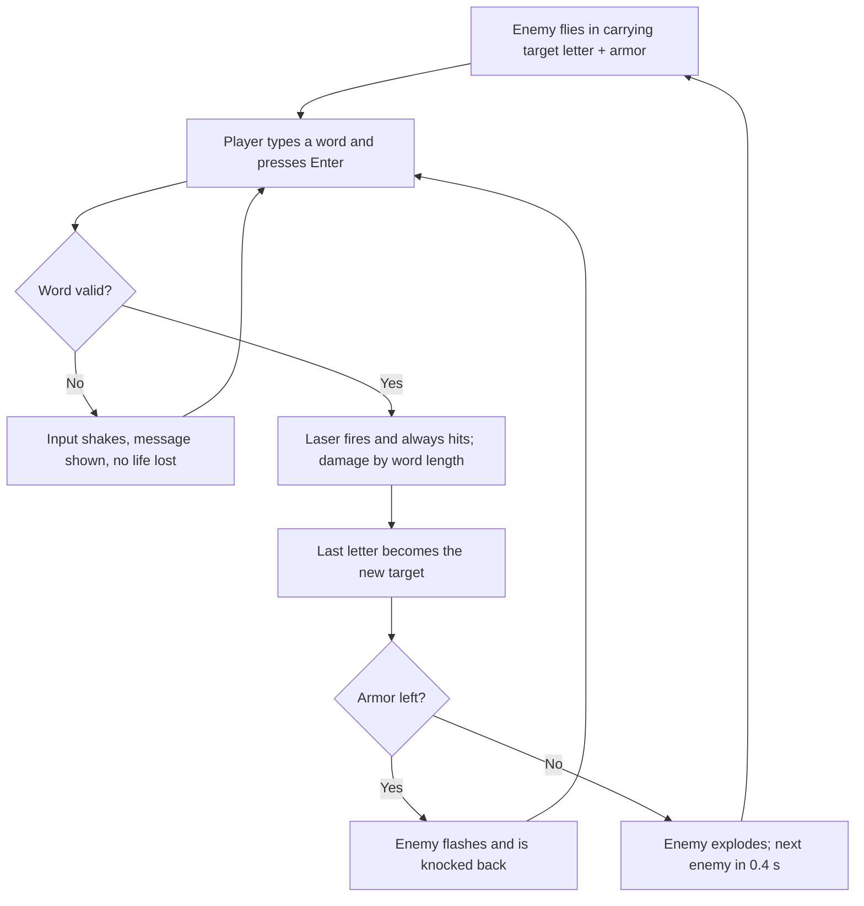

> **Snapshot notice.** This is a copy of the Game Design Doc from the *HugoEnglishClubGame* project, taken on **2026-09-27**. The project copy is the source of truth. When the design changes, update the project doc first, then re-sync this file and note the sync in `CHANGELOG.md`.
>
> The only edit from the original: the embedded core-loop flowchart is redrawn below as a Mermaid diagram so it renders on GitHub.

# Last Letter Blaster — Game Design Doc

Sep 27, 2026 · @Dung Pham

## Overview

Last Letter Blaster is an endless 2D pixel space shooter where every shot is an English word: type a word that starts with the enemy's letter to fire, and its last letter becomes the next target. It is built for the English Club, desktop-first and playable in a mobile browser. The design moved from a runner to a shooter on September 27, 2026, after the runner prototype felt flat in play.

**Design pillars**

- **Typing is the trigger.** No aiming or dodging: a valid word always hits. Skill is vocabulary and typing speed.
- **Longer words, stronger lasers.** Word length sets damage, so a richer vocabulary pays off directly.
- **Learners survive, experts shine.** Tuned so a typical learner lasts 2–3 minutes and fast typists 5+ minutes.
- **Vocabulary you can see grow.** Every new word lands in a lifetime Word Collection.
- **Small enough to finish.** One JavaScript file of about 2,000 lines, one `state` object, constants at the top, no external assets.

**Tech frame:** HTML5 canvas at a fixed internal resolution of 480 × 270 px, drawn at 2× with smoothing off; one DOM `<input>` for typing; saves in `localStorage`; sound synthesized with WebAudio.

## Core loop

The game runs on three nested loops: one word per shot, one run per sitting, and a Word Collection that grows over weeks.

If an enemy reaches your ship before its armor is gone, you lose 1 life and a new enemy flies in with the same letter.

### Moment-to-moment (every 2–7 seconds)

One enemy flies in from the right toward your ship, carrying the target letter and 1–3 armor pips. The player types a word that starts with that letter and presses Enter. A valid word fires a laser that always hits; longer words fire stronger lasers that deal more damage. The word's last letter becomes the new target letter. If armor remains, the enemy is knocked back and the player types again; if not, it explodes and the next enemy arrives 0.4 s later.

### Session (one run plus recap, about 5 minutes)

Pick or tweak your ship in the Hangar, play until all 3 lives are gone, then read the recap: your full word chain, enemies destroyed, achievements earned, score, and whether it made the local top 10. One key press starts the next run.

### Long-term (weeks)

Every new word joins the lifetime Word Collection, shown per letter A–Z. Players return to beat their personal best, climb the club's local leaderboard, and use the Club Word of the Week for its bonus.

## Controls

Typing is the only verb in play: the ship never moves or aims, and every other control is a button or Esc, because any letter key must stay free for words.

| Action | Keyboard (desktop) | Touch (mobile) |
| --- | --- | --- |
| Type a word | Letter keys A–Z (other characters ignored) | On-screen keyboard, auto-opened on run start |
| Delete a letter | Backspace | Keyboard backspace |
| Fire (submit word) | Enter | Keyboard Go/Enter key, or the 56 × 56 px **Fire** button beside the input |
| Clear the input | Esc tapped twice within 0.4 s | Long-press Backspace (native) |
| Pause / resume | Esc, or click the pause button | Pause button, 44 × 44 px, beside Fire |
| Hangar and menus | Arrow keys + Enter, or mouse | Tap |
| Play again from recap | Enter | **Play again** button |

**Rules for the input field**

- One real DOM `<input>` with `autocomplete`, `autocorrect`, `autocapitalize` and `spellcheck` all off, so phone autocorrect cannot type words for the player.
- Input is lowercased and stripped to a–z before validation.
- Focus is forced back to the input on every tap of the play area; typing a letter anywhere on the page goes into the input.
- The game auto-pauses when the window loses focus or the tab is hidden.
- On mobile, the canvas resizes to the space above the keyboard (`visualViewport`), keeping the ship, the enemy and its letter visible.

## Mechanics

One enemy is on screen at a time, enemy speed climbs from 60 to 260 px/s over about 3 minutes 40 seconds, and word length decides laser strength. All numbers are the values in the shooter prototype; they live as constants at the top of the file.

### World and speed

- Internal resolution 480 × 270 px. The ship sits at x = 36, y = 135 (left edge, vertically centred) and is 16 × 11 px; an enemy within **16 px** of it counts as a hit.
- Enemies spawn at x = 500 (just off-screen) at a random height between y = 56 and y = 214, then fly in a straight line at the ship with a 2 px bob.
- Base enemy speed starts at **60 px/s** and rises **0.9 px/s every second**, capping at **260 px/s**. An enemy takes about 7 s to reach the ship at the start and under 2 s at top speed.
- Paused time does not count.

### Enemies

| Enemy | Armor | Speed | Appears from |
| --- | --- | --- | --- |
| Scout | 1 | 100% of base | 0 s |
| Fighter | 2 | 90% of base | 30 s |
| Cruiser | 3 | 80% of base | 60 s |

| Time into run | Scout | Fighter | Cruiser |
| --- | --- | --- | --- |
| 0–30 s | 100% | 0% | 0% |
| 30–60 s | 60% | 40% | 0% |
| 60–90 s | 40% | 40% | 20% |
| 90 s+ | 30% | 40% | 30% |

- The next enemy arrives **0.4 s** after one is destroyed, **1.0 s** after one hits the ship, and **1.0 s** after the run starts.
- **Rare letters (Q, X, Z):** while the target letter is Q, X or Z, the enemy flies at **60%** speed, and any enemy that spawns then is a Scout. The letter badge pulses and a warning tone plays.

### Laser strength

A valid word fires a laser that always hits. Word length sets its strength:

| Word length | Laser | Damage | Look |
| --- | --- | --- | --- |
| 3–4 letters | Light | 1 | 1 px beam, 0.12 s |
| 5–6 letters | Heavy | 2 | 2 px beam with a glow, 0.15 s |
| 7+ letters | Mega | 3 | 3 px beam, glow and a 2 px screen shake, 0.2 s |

- Damage beyond the remaining armor is wasted, so a Mega laser destroys any enemy in one shot.
- An enemy that survives a hit flashes white for **0.1 s** and is knocked back **8 px per point of damage**, buying the player a little time.
- Every valid word moves the chain on, even when it does not destroy the enemy.

### Word validation

Checks run in this order; the first failure shows its message under the score:

1. At least 3 letters → "Too short"
2. Starts with the target letter → "Must start with R"
3. Not used this run → the word flashes red in the used-words strip
4. In the embedded word list → "Not in word list"

A failed word costs no life: the input shakes for **0.25 s** and keeps the text so the player can fix it. A word submitted while no enemy is on screen is refused ("Wait for the next enemy") and not used up. The list holds 9,404 common English words (3–15 letters) stored as one space-separated string and loaded into a `Set`; the Club Word of the Week is always added. Each run starts on a random letter from A B C D E F G H I L M N O P R S T W.

### Lives and damage

- **3 lives** per run. An enemy reaching the ship costs **1 life** and explodes.
- On hit: the ship blinks for **1.0 s**, base speed drops by **20 px/s** (never below 60), the chain streak resets, the screen shakes for 0.25 s, and the target letter stays the same.
- No healing in MVP.

### Scoring

- Word points = **10 × letters × speed multiplier**, where the multiplier = 1 + (speed − 60) ÷ 200, running from ×1.0 to ×2.0, rounded to a whole number.
- Kill bonus = **25 × the enemy's armor** (25, 50 or 75).
- Achievement bonuses are added on top (see Progression).

### Timers at a glance

| Timer | Value |
| --- | --- |
| First enemy after start | 1.0 s |
| Next enemy after a kill | 0.4 s |
| Next enemy after a hit | 1.0 s |
| Laser visible | 0.12 / 0.15 / 0.2 s by strength |
| Enemy hit flash | 0.1 s |
| Ship blink after a hit | 1.0 s |
| Explosion before the recap | 1.2 s |
| Input shake | 0.25 s |
| Resume countdown after pause | 3 s |
| Score and achievement pop-ups | 1.0 s |

**Tuning check:** a simulated typist who needs 2 s to think and 0.3 s per letter survives about 2 min 18 s; a fast typist (0.8 s, 0.12 s per letter) lasts over 5 minutes; a slow learner (3 s, 0.4 s per letter) about 1 min 30 s.

## Win and lose conditions

There is no final win: a run is endless and ends only when the third life is lost, so "winning" means beating a score.

- **Lose:** lives reach 0 → the ship explodes for 1.2 s → the Recap screen opens.
- **Personal win:** score beats your personal best → "New best!" banner and fanfare on the recap.
- **Club win:** score enters the device's top 10 → it is saved under your pilot name and highlighted in the leaderboard.
- **Quitting:** choosing Quit from the pause menu ends the run and goes to the recap; the score still counts.
- **Not a loss:** invalid words, repeated words and pausing never cost a life.

## Progression

Progression is visible, not unlockable: bonus points during a run, and a personal best, leaderboard and Word Collection across runs. Every ship shape and colour is available from the start; nothing unlocks in MVP.

### Achievements (in-run bonuses)

| Achievement | Trigger | Bonus | Repeats in a run |
| --- | --- | --- | --- |
| Long Shot | Valid word of 8+ letters | +50 | Every time |
| One Shot | Destroy a Cruiser with a single Mega laser | +100 | Every time |
| Rare Letter | Valid word starting with Q, X or Z | +100 | Every time |
| Chain Master | 10 valid words in a row without being hit | +200 | Every 10 |
| Double Trouble | Word contains a double letter (e.g. *happy*) | +20 | Every time |
| Club Spirit | Typing the Club Word of the Week | +300 | Once |
| New Discovery | First time this player ever used the word | +30 | Every time |
| Speed Demon | Reach top speed (260 px/s) | +250 | Once |
| Full Shields | Survive 60 s without losing a life | +150 | Once |

Bonuses are added flat (no speed multiplier). Each award shows a 1.0 s pop-up beside the ship; the recap lists each achievement with its count.

### Across runs

- **Word Collection:** every valid word is added to a lifetime set. The collection screen shows the total, a count per letter A–Z, and the words under each letter.
- **Personal best:** the highest score, shown on the title screen and the recap.
- **Local leaderboard:** top 10 scores on this device, each with pilot name, a mini icon of their ship in its colours, score, words in chain and date.
- **Club Word of the Week:** one constant, `CLUB_WORD`, edited weekly by the club leader.

### Saved data (`localStorage`)

| Key | Holds |
| --- | --- |
| `llb.ship` | Pilot name, ship shape, main colour, second colour, laser colour |
| `llb.leaderboard` | Top 10 entries, each with a copy of the ship choice |
| `llb.collection` | Lifetime word list |
| `llb.settings` | Sound on/off, personal best |

Every read and write is wrapped in try/catch; if storage fails, the game still plays and simply does not save.

## UI screens

Seven screens, all drawn on the one canvas except the text input; `state.screen` holds which one is showing. The character creator is replaced by the **Hangar**, where players build their own ship.

| Screen | Shows | Goes to |
| --- | --- | --- |
| Title | Game name, your ship idling over the starfield, personal best, Club Word of the Week, buttons: Play, Hangar, Words, Leaderboard, Sound on/off; a 3-line "How to play" card on first launch | Any screen below |
| Hangar | Ship preview at 4× that test-fires a Light, Heavy and Mega laser in a loop; pilot name (max 12 characters); the four choice rows below; Save | Title |
| Run (HUD) | See HUD layout below | Pause, Recap |
| Pause | Dimmed overlay that hides the enemy and its letter; Resume (3 s countdown), Quit run | Run, Recap |
| Recap | Score, New best banner if earned, enemies destroyed, full word chain as wrapped chips (new words marked), achievements with counts, leaderboard rank | Play again, Title |
| Leaderboard | Top 10: rank, ship icon, pilot name, score, chain length, date | Title |
| Word Collection | Total words, A–Z grid with a count per letter; tap a letter to list its words | Title |

### Hangar choices

Each row has ◀ ▶ arrows (or tappable swatches) and a 🎲 button; a 🎲 All button randomizes everything, and a **Club colors** button sets main and second colour to `CLUB_COLORS`. Choices are cosmetic only: every ship plays the same.

| Choice | Options | Colours which part |
| --- | --- | --- |
| Ship shape | 4: Arrow, Delta, Saucer, Twin | — |
| Main colour | 8: white, silver, red, orange, yellow, green, blue, purple | Hull |
| Second colour | 8: same set as main | Wings, stripes and trim |
| Laser colour | 6: cyan, pink, lime, gold, white, club colour | Every laser beam and the engine flame |

The preview always shows the ship over the real game background, so players can check their colours stand out against space and enemies.

### HUD layout (run screen)

- **Top-left:** 3 hearts.
- **Top-centre:** score, and a × speed multiplier in small type; messages ("Not in word list") appear just below it.
- **Top-right:** chain streak and enemies destroyed.
- **On the enemy:** the target letter in a 20 × 20 px badge above it, and armor pips below it.
- **Bottom edge:** used-words strip, last 6 words, newest first; a repeated word flashes red there.
- **Below the canvas:** the text input, Fire button and Pause button.

## Art direction

Bright retro-arcade pixel art on deep navy space, drawn entirely in code: sprites are character grids in the source, recoloured by palette swap, with no image files.

### Technique

- Canvas at 480 × 270, drawn at 2× and scaled to fit; `imageSmoothingEnabled = false`.
- Each sprite is an array of strings, one character per pixel. Ship grids use palette slots: `.` transparent, `O` outline, `M` main colour, `S` second colour, `W` cockpit window, `F` engine flame (drawn in the laser colour).
- Sprites are pre-rendered once per ship choice into small off-screen canvases, then drawn with `drawImage` each frame.
- Fixed colour lists in `SHIP_MAIN_COLORS`, `SHIP_SECOND_COLORS` and `LASER_COLORS`; club colours in `CLUB_COLORS` (two values, to be confirmed by the club).

### Sprites

| Sprite | Size | Notes |
| --- | --- | --- |
| Player ship, 4 shapes | 16 × 11 to 16 × 14 px | Faces right; flame flickers between 2 frames at 16 fps |
| Scout | 12 × 8 px | Green, 1 armor |
| Fighter | 16 × 10 px | Purple, 2 armor |
| Cruiser | 20 × 12 px | Red, 3 armor |
| Letter badge | 20 × 20 px | Yellow with the letter in bold; orange pulse on Q, X, Z |
| Armor pip | 4 × 4 px | Pink when full, faint when lost |

Enemy colours are fixed so players learn them; laser colours are chosen to stay readable against all three.

### Lasers

The laser is the reward for a long word, so its strength must be visible at a glance:

- **Light (1 damage):** a thin 1 px beam in the laser colour.
- **Heavy (2 damage):** a 2 px beam with a 4 px translucent glow and a brighter flash at the ship's nose.
- **Mega (3 damage):** a 3 px beam with a wide glow, a white core, a 2 px screen shake and extra sparks at the impact point.

### World

- **Space:** flat deep navy (#0E1030).
- **Starfield:** 70 stars in three layers scrolling left at 0.2×, 0.5× and 1×; drift speed rises with enemy speed, so the game visibly speeds up.

### Feedback

- Enemy hit but alive: white flash and knockback.
- Enemy destroyed: a burst of 10 + 4 × armor sparks and a gold score pop-up.
- Ship hit: 0.25 s screen shake, sparks, ship blinks for 1.0 s.
- Invalid word: input shakes and the message appears in red.
- Text uses the system `monospace` font in bold; no web fonts.

## Audio

All sound is synthesized at runtime with WebAudio oscillators and a noise buffer, so there are no audio files; MVP has sound effects only, no music.

| Event | Sound | Length |
| --- | --- | --- |
| Keystroke | Square wave, 880 Hz, very quiet | 20 ms |
| Light laser | Square sweep 1200 → 500 Hz | 80 ms |
| Heavy laser | Light laser plus a sawtooth layer an octave lower | 120 ms |
| Mega laser | Heavy laser plus a noise burst and a low 60 Hz thump | 200 ms |
| Enemy hit, still alive | Short high blip | 50 ms |
| Enemy destroyed | Noise burst with falling filter | 250 ms |
| Ship hit | Low noise burst, 110 Hz rumble | 300 ms |
| Invalid or repeated word | Low buzz, 110 Hz sawtooth | 150 ms |
| Achievement | Three-note chime (C5 E5 G5) | 300 ms |
| Rare letter warning | Two alternating tones, twice | 400 ms |
| Game over | Four falling notes | 800 ms |
| New best | Short rising arpeggio | 600 ms |

- Master volume 0.5; keystroke at 0.1 so fast typing is not tiring.
- The Hangar preview plays the three laser sounds as it test-fires.
- The `AudioContext` is created on the first click or key press (browser autoplay rules).
- One sound on/off toggle on the Title and Pause screens, saved in settings.

## Scope

MVP is everything needed for one complete, replayable run with a custom ship, a local leaderboard and a Word Collection; anything else waits until MVP is playtested with the club.

| Feature | Scope | Note |
| --- | --- | --- |
| Typing input, validation, last-letter chain | MVP | Core verb; done in prototype |
| One enemy at a time, speed ramp, 3 enemy types | MVP | Done in prototype |
| Laser strength by word length (1 / 2 / 3 damage) | MVP | Damage done; Heavy and Mega visuals still to build |
| 3 lives, pause, auto-pause, resume countdown | MVP | Done in prototype |
| No-repeat rule + used-words strip | MVP | Done in prototype |
| Scoring and 9 achievements | MVP | 4 in prototype |
| Hangar: 4 ship shapes, main, second and laser colour, 🎲, Club colors | MVP | Palette swap only; cosmetic |
| Recap screen with word chain | MVP | Done in prototype |
| Local top 10 leaderboard with ship icons | MVP | `localStorage` |
| Word Collection (lifetime) | MVP |  |
| Club Word of the Week constant | MVP | Edited in code |
| Mobile layout above on-screen keyboard | MVP | Desktop-first |
| Synthesized sound effects + mute | MVP |  |
| Procedural background music that follows speed | Nice-to-have | WebAudio loop |
| Two enemies on screen at once late in a run | Nice-to-have | Only if single enemies get dull |
| +1 life every 25 kills (max 3) | Nice-to-have | Only if runs feel too short |
| Definition pop-up for words on the recap | Nice-to-have | Needs a larger data set |
| Export or share recap as an image | Nice-to-have |  |
| More ship shapes or decals | Nice-to-have | Cheap once the Hangar exists |
| Ship movement, aiming or dodging | Cut | Typing stays the only verb |
| Ships with different stats | Cut | Keeps choices cosmetic and fair |
| Boss enemies | Cut |  |
| Online leaderboard with Google sign-in | Cut | Version 2, per concept |
| Accounts and cloud save | Cut | Version 2 |
| Unlockable ships or colours | Cut | Out of scope per concept |
| Themed-word achievements | Cut | Out of scope per concept |
| Power-ups | Cut | Out of scope per concept |
| Daily seeds | Cut | Out of scope per concept |
| External sprite pack | Cut | Unless the club asks |
| Multiplayer or versus mode | Cut |  |

## Open questions

- [ ] Is "Last Letter Blaster" the final name, or a working title?
- [ ] Which devices do club members mostly use? Decides how much time goes into the mobile layout.
- [ ] Are 4 ship shapes, 8 hull colours and 6 laser colours enough choice, or too much for MVP?
- [ ] Does a typical learner really last 2–3 minutes? The simulation says about 2 min 18 s; confirm in a club playtest.
- [ ] The prototype uses the public google-10000-english list (9,404 words after filtering). Confirm its license, prune odd entries, and add more X words (only 9).
- [ ] What are the two club colours for `CLUB_COLORS`?
